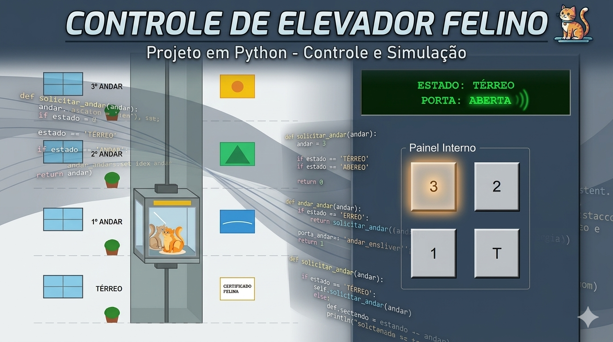

# Projeto Controle de Elevador & HUB Central (AP)

 > ℹ️ **NOTE:** ste documento foi estruturado a partir da documentação do projeto “Controle de Elevador & HUB Central (Case 2)”, com o objetivo de organizar e facilitar a compreensão e reprodução do sistema baseado em Autômato de Pilha (AP).

Projeto desenvolvido com o objetivo de simular o funcionamento lógico de um elevador residencial de quatro níveis, utilizando conceitos de Teoria da Computação, Linguagens Formais e Autômatos de Pilha, com foco em memória, estados e transições lineares.

## 💻 Tecnologias utilizadas no projeto

- Python
- Tkinter
- Conceitos de Autômato de Pilha (AP)
- Interface gráfica
- Lógica de programação estruturada

## ✨ Como foi feito ?

<b>Modelagem do sistema</b>

Definição formal de um Autômato de Pilha (AP) composto por:
- Estados
- Alfabeto de entrada
- Alfabeto da pilha
- Funções de transição
- Estado inicial
- Símbolo de fundo da pilha

<b>Definição dos estados</b>

Foram criados estados representando o elevador parado em cada andar:
- q0a → Térreo
- q1a → 1º andar
- q2a → 2º andar
- q3a → 3º andar

Cada estado representa o elevador com as portas abertas aguardando chamadas.

<b>Memória com pilha</b>

Diferente de um autômato finito tradicional, o sistema utiliza uma pilha para armazenar os destinos solicitados pelo usuário.

A lógica implementada garante:
- Controle de chamadas
- Sequenciamento correto
- Memória temporária de destinos
- Processamento linear de movimentação

<b>Movimentação linear</b>

O elevador obrigatoriamente percorre os andares intermediários antes de chegar ao destino final.
Exemplo:
Se o elevador estiver no térreo e o destino for o 3º andar:
Ele passará pelo 1º e 2º andar antes de chegar ao 3º.

<b>Interface gráfica</b>

Desenvolvimento de elementos visuais como:
- Painel industrial moderno
- Indicadores de subida e descida
- Botões dinâmicos
- Feedback visual ao pressionar comandos
- Centralização automática da janela
- Simulação visual da cabine do elevador

<b>Passageiro especial</b>

Para tornar a experiência mais visual e interativa, foi implementado um passageiro fixo representado por um gato.
A imagem acompanha dinamicamente a cabine do elevador durante toda a movimentação.

<b>HUB Central</b>

O projeto também conta com um HUB Central, responsável por integrar os sistemas desenvolvidos durante o semestre.
O HUB permite acessar:
- Case 1 → Vending Machine
- Case 2 → Controle de Elevador
As janelas funcionam de maneira independente utilizando o conceito de Toplevel do Tkinter.

## 🛠️ Instruções de execução

- 🤖 1. Inicialização do sistema
Execute o HUB Central ou diretamente o sistema do elevador.
- 🤖 2. Seleção do andar
Pressione um dos botões correspondentes aos andares disponíveis.
- 🤖 3. Armazenamento na pilha
O destino será armazenado na pilha para processamento.
- 🤖 4. Movimentação do elevador
O sistema executará o deslocamento linear passando pelos andares intermediários.
- 🤖 5. Feedback visual
As setas e indicadores mostrarão a direção atual do elevador.
Se inválido → operação finalizada com erro
- 🤖 6. Chegada ao destino
Ao alcançar o andar solicitado:
    - O elevador para
    - As portas abrem
    - O estado correspondente é atualizado

## 📌 Considerações finais

Este projeto demonstra na prática a aplicação de Autômatos de Pilha em sistemas que necessitam de memória e controle sequencial. A implementação garante movimentação consistente, transições corretas e uma interface intuitiva, tornando a simulação robusta e alinhada aos conceitos estudados na disciplina.

## 👨‍💻 Expert

    
&nbsp&nbsp&nbspJuliana Benedetti 
    &nbsp&nbsp&nbsp
    <a 
        href="https://github.com/JujuBene">
        GitHub
    </a>
    &nbsp;|&nbsp;
    <a 
        href="https://www.linkedin.com/in/juliana-magiero-benedetti/">
        LinkedIn
    </a>
   

    
&nbsp&nbsp&nbspNatália Brediks 
    &nbsp&nbsp&nbsp
    <a 
        href="https://www.linkedin.com/in/natalia-brediks-miltus-marques/">
        LinkedIn
    </a>

    
&nbsp&nbsp&nbspMariana Cardoso 
    &nbsp&nbsp&nbsp
    <a 
        href="https://www.linkedin.com/in/marianacbrand%C3%A3o/">
        LinkedIn
    </a>

    
&nbsp&nbsp&nbspRuan Luz 
    &nbsp&nbsp&nbsp
    <a 
        href="https://www.linkedin.com/in/ruanviniciusluz/">
        LinkedIn
    </a>

    
&nbsp&nbsp&nbspCaio Camargo 
    &nbsp&nbsp&nbsp
    <a 
        href="https://www.linkedin.com/in/caio-camargo-049777313/">
        LinkedIn
    </a>

  

---
